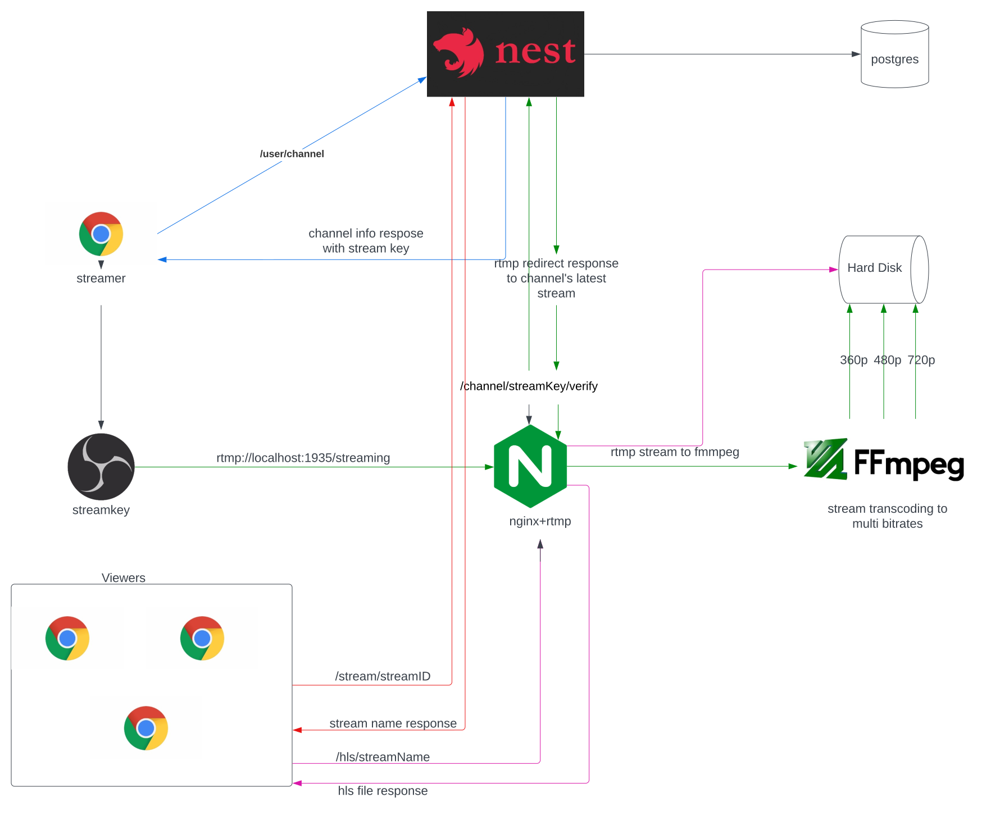

# Streammmm

A `real-time` live streaming web backend written in NestJS.

## Run Locally

```
git clone https://github.com/Neeraj319/streammmm
```

```
cd streammmm
```

- Create .env file and add environment variables according to .env.example

## Using Docker

```
make build
```

- for nth run

```
make up
```

## Normal Installation (This won't work if you are using windows use docker installation instead or use WSL)

- Install nodejs from https://nodejs.org/en/
- Install PostgreSQL from https://www.postgresql.org/download/
- Follow this manual to install niginx-rtmp module https://github.com/arut/nginx-rtmp-module/
- Install FFMPEG from https://ffmpeg.org/download.html

```
npm install yarn
```

```
yarn install
```

- copy the nginx.conf file present in rtmp/ folder and add it to /etc/nginx/
- Reload nginx with

```
sudo nginx -s reload
```

- Database setup
  Add your own config and make sure to edit .env file

```
yarn start:dev
```

# Architecture



## Using the API

- go to http://localhost:nest_js_port:/docs to view the documentation of the API

## Streaming using the API

- Create a user and it's channel by following the api docs. Now create a video grab your stream key from api (Look at the API docs for all API endpoints)
- Install OBS from -> https://obsproject.com/download
- Open OBS follow the default instructions for setup
- Follow the images below for instructions


- Select Screen Capture (XSHM) and OK


### Stream Key setup

- In the up-left coroner you will find files options. You will also find Settings option there. Select stream option and follow the instructions in the image


- Set Server Url to: `rtmp://localhost:1935/streaming`
- In streamkey inputbox make sure to get the right stream key of your channel otherwise it won't work.

- Now start the stream by:


### To view the stream you can use VLC media player or HLS demo app

#### I'll be showing with HLS demo app

- go to https://hls-js.netlify.app/demo/

- hls stream url: `http://localhost:8080/hls/generate_stream_file_name.m3u8`

- Change the last url parameter to your stream/videos's file name provided by the api


You should be able to view the stream on the player now.

## Contributing

Contributions are always welcome!

See `contributing.md` for ways to get started.

Please adhere to this project's [code_of_conduct.md](https://github.com/Neeraj319/streammmm/blob/main/code_of_conduct.md).
