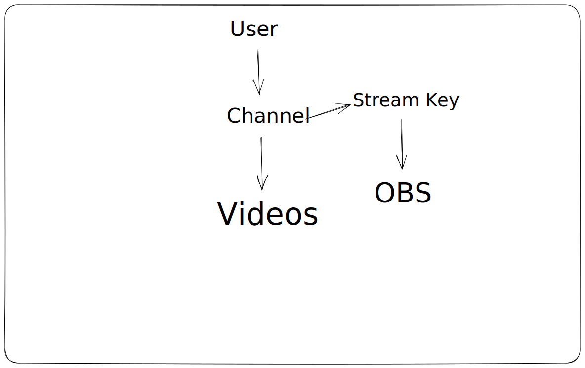

.. _application_architecture:

Application's Architecture
==========================

There are 3 main components of the backend. 

.. [#] The RestAPI
.. [#] The RTMP service 
.. [#] The worker service

The RestAPI  
-----------
The RestAPI is written in `NestJS
<https://docs.nestjs.com/>`__ (TypeScript). The reason why I went with this framework is cause I had not worked with 
any other nodejs backend frameworks expect *expressjs*. So, I wanted to get my hands dirty with nodejs and TypeScript. For database 
I have used `Postgresql
<https://www.postgresql.org/>`__ as for ORM I have used `prisma 
<https://www.prisma.io/>`__.

The RTMP service 
---------------
This is the heart of the application. The entire point of this application's existence comes to this one service. Whenever 
a streamer starts the stream the stream is sent to this service. Then it gives the stream to `FFMPEG 
<https://ffmpeg.org/>`__ which converts the 
RTMP stream to *HLS* video formats. The stream is transcoded to multiple bitrate (low, high, mid). This ensures adaptive 
bitrate. 

.. note::
    If you don't have a PC with good specs, then it's a bad idea to run this project for a long time. This only implies if you are 
    using the streaming feature, since video transcoding takes a lot of cup/gpu power it's not a good idea to run the steam 
    for longer period of time.

The Worker service
-----------------
This service is responsible for resizing user profile pictures. I know that this is a little bit over kill and there are 100s of library that can process 
images at once and send the response back but the sole reason why I implemented it this way is cause to increase my familiarity with *microservice* architecture.

For RPC communication I have used `RabbitMQ
<https://www.rabbitmq.com/>`__. When an user uploads his/her image trough the RestAPI, the image is saved to the file system. 
Along with this a new file name 
is generated which at first gets saved to the database and then is sent to the message broker. Then the message is consumed by the consumer 
`(Celery)
<https://docs.celeryq.dev/en/stable/getting-started/introduction.html>`__ which then process the image and saves it on the file system.

How does it actually work?
-------------------------
Let's start from the beginning.

At first we need to register a user. So, to register a  user we send *post* request on ``aut/signup``. After user creation we need to login of course.
So to get `jwt 
<https://jwt.io/>`__ token we again send *post* request to ``auth/login``. Here we will get two jwt tokens

- Access Token 
    Used for accessing the protected endpoints like ``user/channel``, ``user/profile`` etc. Also Access Token is short lived meaning it has a small 
    validity time. This is done cause even if someone steals our token then they won't be able to access anything afterwards (after 10 or 20 minutes).
- Refresh Token 
    User for getting another set of access & refresh token. It has a longer validity time so that users won't have to login again and again by reentering their
    username and password.

Also when a user logins the backend sets ``httponlycookies`` for refresh and access tokens, making it less prone to XSS attacks.

Now that the user has an account and can login we need to create a channel for user. 

By default a user doesn't make a channel, They need to create it which can be done from sending a post request to ``user/channel/videos>``. As response ``streamKey`` with other channel information is also sent. This part is curtail and important 
cause stream key is necessary for streaming to your channel and they must to kept as a secret. 

.. note::
    If other users get access to your stream key, they can easily stream from your account. You MUST keep it a SECRET.

After they stream key is generated now users needs a video. At least one video on the channel is compulsory for title and thumbnail generation.
We can create a video by sending a post request to ``/user/channel/videos/``. After the video is created you get ``url`` on the response. This ``url`` is the new 
file name generated and is also used to access the stream.

Now that everything is set the user can setup OBS and start streaming. Once they hit start streaming the stream is sent to the RTMP service on 
``rtmp://localhost:1935/streaming``. After this request is successful the service now sends a http request to the RestAPI to get the ``stream name`` to save
the stream with the appropriate file name. The same request also authenticates the user with the stream key. If the RestAPI dose not find the stream key in the 
database then the stream is closed by the rtmp service. This happens only when the stream key is not found and the server send 400 as response and rtmp service 
stops the stream.

.. note::
    Also if the user has not made a new video then a new video is created with the same title and thumbnail in the database.

Once all of this is complete the stream is sent to *FFMPEG* which then converts the stream to multiple bitrate hls videos. 

Now to access these hls videos we all we need is a hls library for running it on the browser. THese streams are served on ``http://localhost:8080/hls-live/your_video_url.m3u8``
. Note that the video url which was returned at first must be used in place of `your_video_url.m3u8`.